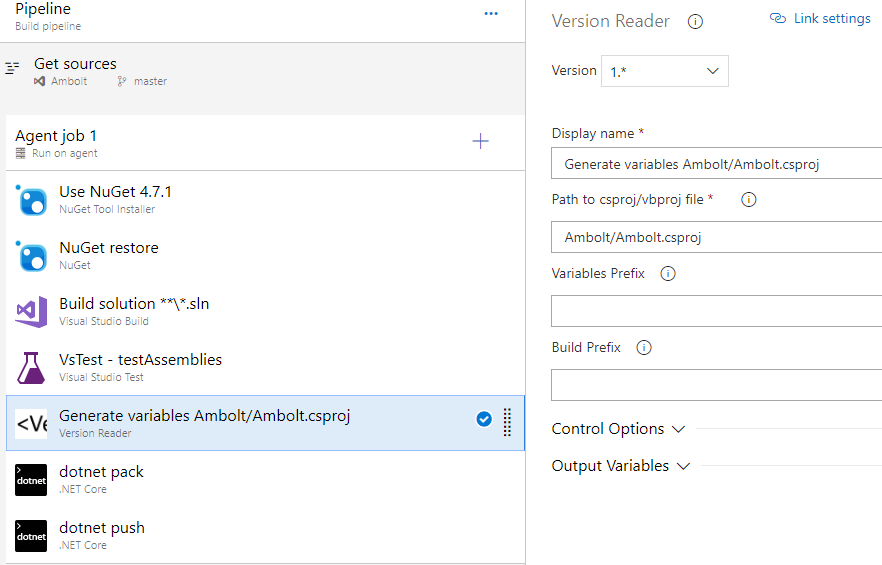
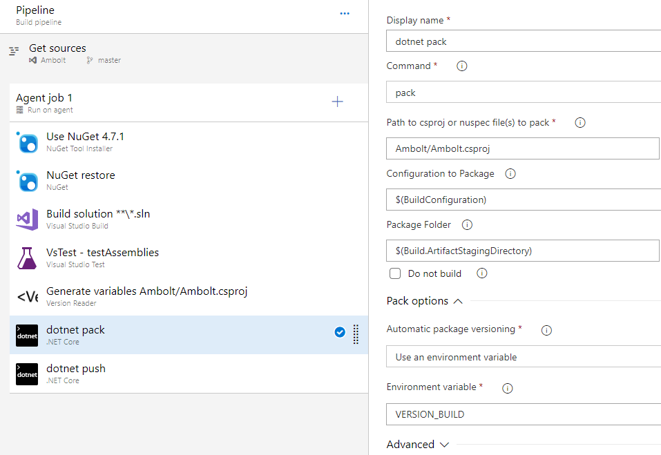

# VersionReaderTask
VSTS build task to read Version tag from project files

Reads the `<Version>` tag from new `csproj` and `vbproj` 2017 format files into environment variables.

This tool was created to fix an issue with the new `.xxproj` project format. The new format does not support wildcard in the version and therefore auto-append of build suffix, which was previously supported.

Adapted from [AssemblyInfoReaderTask](https://github.com/kyleherzog/AssemblyInfoReaderTask) with thanks to [kyleherzog](https://github.com/kyleherzog)

## Example Usage

The `VersionReaderTask` can be added after the build or the test task to extract the version details from the project. In the example below it runs after the test task and extracts the version from the `Ambolt.csproj` file.

The **Variables Prefix** setting can optionally be specified to differentiate the variable names, for example if you are running `VersionReaderTask` several times in a build. e.g. `DEMO_` will result in the variables `DEMO_VERSION` and `DEMO_VERSION_BUILD`.

The **Build Prefix** is used to specify a separator between the version and the BuildID values. For example, if the version is `1.2.3` and the build ID is `5678`, and no prefix is specified, `BUILD_VERSION` will be `1.2.35678`. If you specify `.` as the prefix, the `BUILD_VERSION` will be `1.2.3.5678`

The value is then used in a `dotnet pack` task as follows:

Note the **Automatic package versioning** is set to `Use an environment variable`
and the **Environment variable** is set to `VERSION_BUILD` value generated by the version reader task.

## Version History

### Version 1.12

Removed update in 1.11 - should have used BUILD PREFIX as . in the task. Also amended the logging to make it clearer exactly what values are being set.

### Version 1.11

Amended code to ensure version has a '.' at the end before the BUILDNO (fixed bug in v1.10)

### Version 1.9

Added `.Trim()` to version reads - can sometimes have space after the version tag.

### Version 1.8

Added fix for blank Version. Sometimes in simple projects the `Version` tag is absent because the value is the same as the `AssemblyVersion`. Added a check for a blank version being returned and attempts to use the `AssemblyVersion` value instead.
